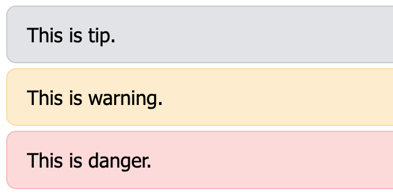
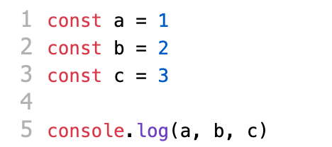

# markdown-it-plugins [](https://www.npmjs.com/package/markdown-it-plugins)

A collection of plug-ins that extend the Markdown-it parser.

## Install

```shell
npm i markdown-it-plugins -D
```

## Usage
```js
import MarkdownIt from 'markdown-it'
import { noticeboard } from 'markdown-it-plugins'

const markdown = new Markdown({
  // ...
})
  .use(noticeboard)
```

## Plugins

### container
Use Vue.js style content blocks to present your message.

```js
import { container } from 'markdown-it-plugins'
// preset styles
import 'markdown-it-plugins/container.css'

markdown.use(container)
```

#### example
Optional values: [ **details** | **tip** | **danger** | **warning** ]


TIP:
```
::: <type> [title]
  content message
:::
```

```
::: details title message
message
:::

::: tip spoiler
message
:::

::: danger spoiler
message
:::

::: warning spoiler
message
:::
```

### noticeboard
A lightweight prompt box containing only tip and Danger types.

```js
import { noticeboard } from 'markdown-it-plugins'
import 'markdown-it-plugins/noticeboard.css'

markdown.use(noticeboard)
```

#### example


```
?> This is tip.
!> This is danger.
```


### collectBlockCode
To add foldable functionality to a code block, you can also give it a code block name.

```ts
import {
  // TypeScript
  type CollectBlockCode,
  collectBlockCode,
} from 'markdown-it-plugins'
import 'markdown-it-plugins/collect-block-code.css'

markdown.use(collectBlockCode, options)
// TypeScript
markdown.use<CollectBlockCode>(collectBlockCode, options)
```

#### options
```ts
interface CollectCodeBlock {
  /**
   * Show the code block language.
   * @type {boolean}
   * @default true
   */
  lang?: boolean

  /**
   * Shows the copy code block content button.
   * @type {boolean}
   * @default false
   */
  copy?: boolean

  /**
   * Copy the content button text.
   * @type {string}
   * @default: 'Copy'
   */
  copyText?: string

  /**
   * The delimiter for the code block name.
   * @type {string}
   * @default ':'
   */
  separator?: string

  /**
   * Display code block names.
   * @type {boolean}
   * @default false
   */
  blockName?: boolean

  /**
   * Always expand the code block.
   * @type {boolean}
   * @default true
   */
  alwaysOpen?: boolean
}
```

#### example


````
```js : block name
const a = 1
const b = 2
const c = 3

console.log(a, b, c)
```
````

### extendImageTitle
Set additional properties at the position of the image's title parameter.

```js
import { extendImageTitle } from 'markdown-it-plugins'

markdown.use(extendImageTitle)
```

#### example


```md

```

### codeLineNumbers
Add a line count display to your code block.(**Need to register before other plugins!, The final effect may vary depending on your style**)

```js
import { codeLineNumbers } from 'markdown-it-plugins'
import 'markdown-it-plugins/code-line-numbers.css'

markdown.use(extendImageTitle)
```

#### example

